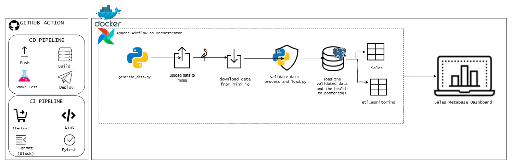
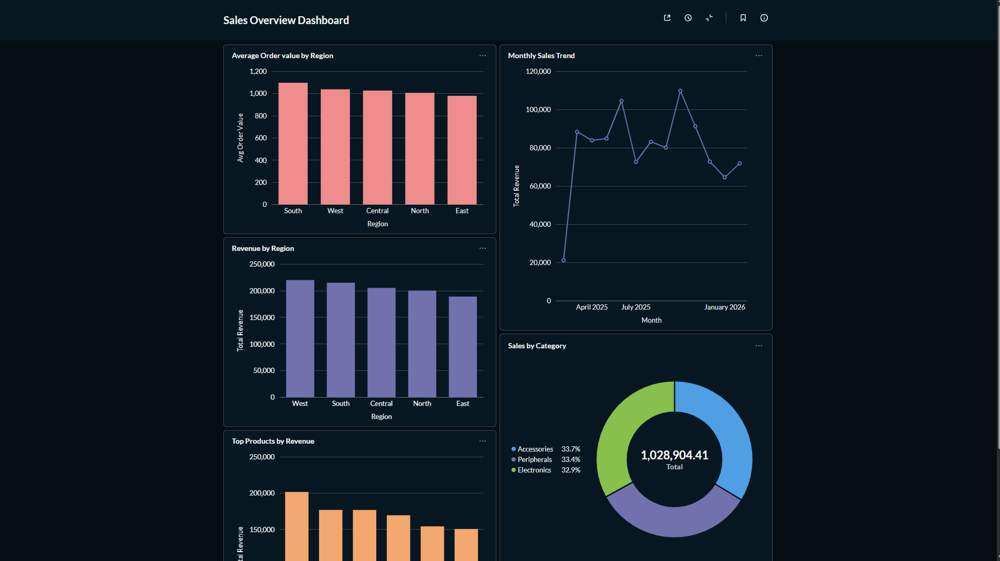
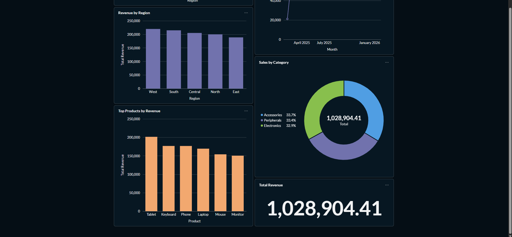
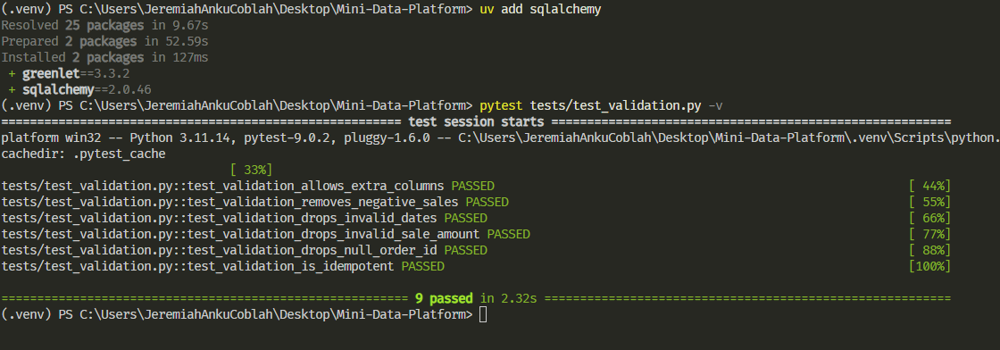
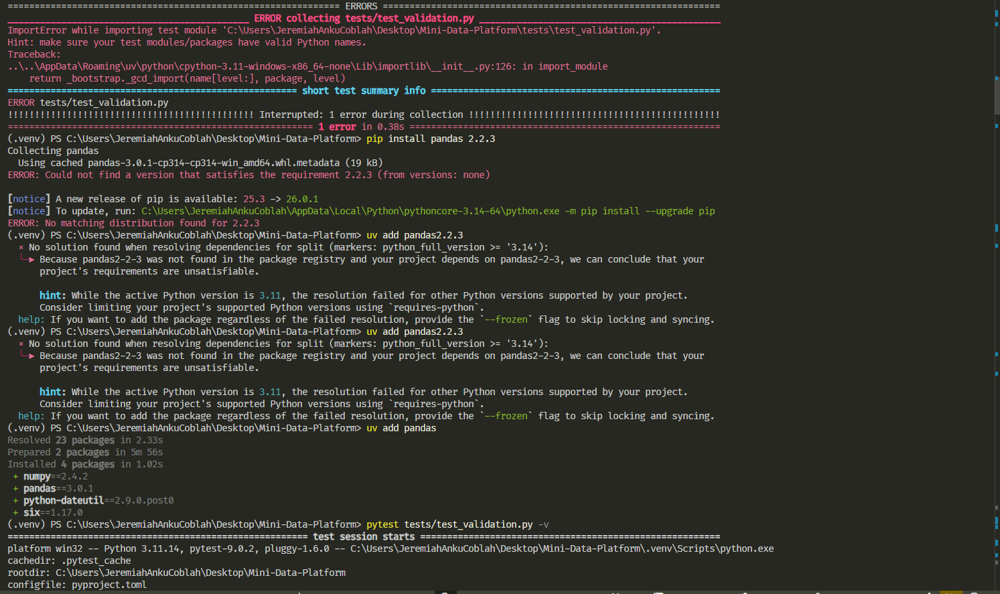
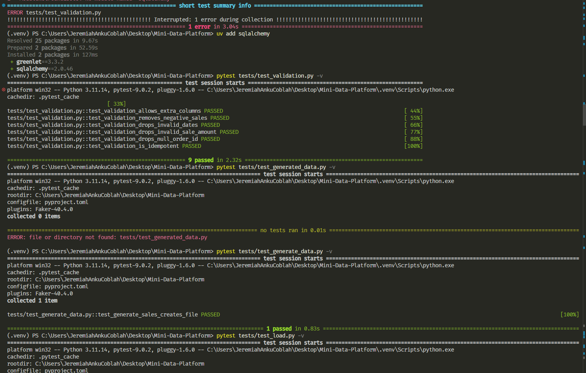

# Mini Data Platform

A fully containerized end-to-end data platform built using:

* PostgreSQL – Relational data warehouse
* Apache Airflow – Workflow orchestration
* MinIO – S3-compatible object storage
* Metabase – Business intelligence dashboards
* Pytest + GitHub Actions – CI/CD and data validation

---

# Architecture Overview

## System Architecture



---

# Project Goal

Build a production-style mini data platform that:

* Generates synthetic sales data
* Uploads raw files to object storage
* Validates and processes the data
* Loads clean data into PostgreSQL
* Visualizes KPIs in Metabase
* Runs automated CI/CD pipelines
* Enforces data quality checks

---

# Project Structure

```
.
├── .github/workflows/        # CI/CD pipelines
├── database/                 # Database initialization scripts
├── orchestration/            # Airflow DAGs
│   └── dags/
│       └── sales_pipeline.py
├── scripts/                  # Data generation, validation, loading logic
│   ├── generate_data.py
│   ├── process_and_load.py
│   └── upload_to_minio.py
├── tests/                    # Unit tests
├── docker-compose.yml
├── Dockerfile
├── requirements.txt
└── README.md
```

---

# Data Flow

## 1. Data Generation

* Synthetic sales data generated using Faker
* Enforces unique order IDs
* Outputs structured CSV file

## 2. Upload to Object Storage

* Raw file uploaded to MinIO
* Simulates cloud-based ingestion pattern

## 3. Airflow ETL Pipeline

DAG: `sales_etl_pipeline`

Pipeline sequence:

```
generate → upload → download → validate → load → Monitor
```

### Validation Stage Includes:

* Strict schema enforcement
* Data type casting
* Domain validation
* Business rule enforcement
* Duplicate detection
* Data quality threshold gating

## 4. Load to PostgreSQL

* Idempotent insert strategy
* Uses `ON CONFLICT DO NOTHING`
* Prevents duplicate records

## 5. Visualization with Metabase

* Connects directly to PostgreSQL
* Provides analytical dashboards

---

# Dashboard Preview

Preview:




Full interactive export:
[View Sales Dashboard (PDF)](./docs/Metabase%20-%20Sales%20Overview%20Dashboard.pdf)


Recommended dashboard metrics:

* Total Revenue
* Sales by Region
* Sales by Product
* Daily Sales Trend
* Record Counts

---

# Testing and Validation

Testing framework: pytest

Coverage includes:

* Data generation correctness
* Validation rules enforcement
* Load idempotency
* MinIO upload behavior (mocked)
* Schema integrity checks
* Business rule validation

Run tests:

```
pytest tests/ -v --cov=scripts
```

Add screenshot:









# How to Run the Platform

## Prerequisites

Ensure the following are installed:

* Docker (v24+ recommended)
* Docker Compose (v2+)
* Git

Verify installation:

```
docker --version
docker compose version
```

---

## 1. Clone the Repository

```
git clone https://github.com/Jerry-Khobby/Mini-Data-Platform
cd Mini-Data-Platform
```

---

## 2. Create the `.env` File

Create a `.env` file in the project root:

```
POSTGRES_USER=platform_user
POSTGRES_PASSWORD=platform_password
POSTGRES_DB=platform_db

MINIO_ROOT_USER=minioadmin
MINIO_ROOT_PASSWORD=minioadmin123
MINIO_BUCKET=sales-data

AIRFLOW__CORE__FERNET_KEY=your_fernet_key
AIRFLOW__WEBSERVER__SECRET_KEY=your_webserver_secret
```

### Generate a Fernet Key

Run:

```
python -c "from cryptography.fernet import Fernet; print(Fernet.generate_key().decode())"
```

Paste the output into:

```
AIRFLOW__CORE__FERNET_KEY=
```

For local development, any random string can be used for:

```
AIRFLOW__WEBSERVER__SECRET_KEY=
```

---

## 3. Build and Start the Platform

From the project root:

```
docker compose up -d --build
```

What happens during startup:

* PostgreSQL container initializes with schema
* MinIO starts and creates the default bucket
* Airflow initializes the metadata database
* Airflow creates an admin user
* Scheduler and Webserver start
* Metabase connects to PostgreSQL

To check logs:

```
docker compose logs -f
```

To check a specific service:

```
docker compose logs -f airflow-webserver
```

---

## 4. Access the Services

| Service    | URL                                            | Credentials               |
| ---------- | ---------------------------------------------- | ------------------------- |
| Airflow    | [http://localhost:8080](http://localhost:8080) | admin / admin             |
| Metabase   | [http://localhost:3000](http://localhost:3000) | Setup wizard on first run |
| MinIO      | [http://localhost:9001](http://localhost:9001) | From `.env`               |
| PostgreSQL | localhost:5432                                 | From `.env`               |

---

## 5. Trigger the Airflow Pipeline

1. Open Airflow UI
   [http://localhost:8080](http://localhost:8080)

2. Login using:

   * Username: `admin`
   * Password: `admin`

3. Locate DAG:

   ```
   sales_etl_pipeline
   ```

4. Enable the DAG (toggle switch)

5. Click “Trigger DAG”

Pipeline stages:

```
generate → upload → download → validate → load → monitor
```

---

## 6. Configure Metabase

On first access:

1. Open [http://localhost:3000](http://localhost:3000)
2. Complete setup wizard
3. Connect to PostgreSQL using:

```
Host: postgres
Port: 5432
Database: platform_db
Username: platform_user
Password: platform_password
```

4. Create dashboards using the `sales` table

---

## 7. Run Tests (Optional)

If running tests locally (outside Docker):

```
python -m venv .venv
source .venv/bin/activate  # Windows: .venv\Scripts\activate
pip install -r requirements.txt
pytest tests/ -v --cov=scripts
```


## 7a. Run Tests Inside Docker

To run tests inside the Airflow container:

1. Enter the Airflow webserver container:

```
docker exec -it platform-airflow-webserver bash
```

2. Install testing dependencies inside the container:

```
pip install pytest psycopg2-binary
```

3. Run your monitoring tests:

```
pytest /opt/project/tests/test_monitoring_inserts.py -v
```

4. (Optional) Run all tests:

```
pytest /opt/project/tests/ -v
```

Notes:

* Make sure the PostgreSQL service is running and the database/schema exists (`etl_monitoring` table should be present).
* Dependencies installed this way are temporary; if the container is recreated, they need to be reinstalled.

---

## 8. Stop the Platform

```
docker compose down
```

To remove volumes (reset database and MinIO data):

```
docker compose down -v
```

---

## 9. Rebuild After Code Changes

If you modify:

* Dockerfile
* requirements.txt
* Airflow dependencies

Run:

```
docker compose down
docker compose up -d --build
```

---

# Service Startup Order

Your platform starts in this dependency order:

1. PostgreSQL
2. MinIO
3. MinIO bucket initialization
4. Airflow metadata initialization
5. Airflow Scheduler
6. Airflow Webserver
7. Metabase

This ensures proper service health checks and avoids race conditions.

---

# First-Time Troubleshooting

If Airflow fails during initialization:

```
docker compose down -v
docker compose up -d --build
```

If a container is unhealthy:

```
docker compose ps
docker compose logs <service-name>
```

---


# CI/CD Pipeline

GitHub Actions automates:

## Continuous Integration

* Dependency installation
* Code linting
* Black formatting check
* Unit test execution with coverage
* Airflow DAG import validation

## Continuous Deployment

* Docker image build
* Container deployment to test environment

## Data Flow Validation

Automated checks ensure:

MinIO → Airflow → PostgreSQL → Metabase

Pipeline fails if:

* Schema mismatch occurs
* Validation threshold exceeded
* DAG import fails
* Tests fail

Add badge:


---

# Data Engineering Concepts Demonstrated

* Containerized data platform architecture
* Orchestrated ETL workflows
* Idempotent data loading
* Data contract enforcement
* Domain validation and quality thresholds
* Observability through logging
* CI-integrated validation
* Infrastructure reproducibility
* Modular Python design

---

# Engineering Design Decisions

## MinIO

Used to simulate cloud object storage (S3) in a local environment.

## Airflow

Chosen as an industry-standard orchestration engine with DAG-based workflow management.

## Idempotent Loads

Prevents:

* Duplicate fact rows
* Metric inflation
* Data inconsistency

## Strict Validation Before Load

Prevents:

* Downstream dashboard corruption
* Schema drift
* Persistence of invalid data

---


# Summary

This project demonstrates the design and implementation of a production-style data platform with:

* Structured ingestion
* Strong validation layer
* Controlled data loading
* Business-facing dashboards
* Automated CI/CD validation


